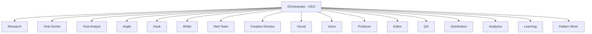

# MOC — Agentes

Definições dos agentes autônomos do Polvo 4.1.

Cada agente tem responsabilidades, inputs/outputs e ferramentas claramente definidos.

---

## Hierarquia dos Agentes



---

## Catálogo de Agentes

| # | Agente | Função | Status | Definição |
|---|---|---|---|---|
| 01 | Orchestrator | CEO do Polvo | definido | [[06_Agentes/Orchestrator\|Orchestrator]] |
| 02 | Research | Pesquisador | definido | [[06_Agentes/Research\|Research]] |
| 03 | Viral Hunter | Caçador de virais | definido | [[06_Agentes/Viral Hunter\|Viral Hunter]] |
| 04 | Viral Analyst | Desmontador de virais | definido | [[06_Agentes/Viral Analyst\|Viral Analyst]] |
| 05 | Angle | Especialista em ângulo | definido | [[06_Agentes/Angle\|Angle]] |
| 06 | Hook | Especialista em hook | definido | [[06_Agentes/Hook\|Hook]] |
| 07 | Writer | Roteirista | definido | [[06_Agentes/Writer\|Writer]] |
| 08 | Red Team | Crítico/destruidor de ideias | definido | [[06_Agentes/Red Team\|Red Team]] |
| 09 | Creative Director | Diretor criativo/storyboard | definido | [[06_Agentes/Creative Director\|Creative Director]] |
| 10 | Visual | Produtor visual | definido | [[06_Agentes/Visual\|Visual]] |
| 11 | Voice | Produtor de voz | definido | [[06_Agentes/Voice\|Voice]] |
| 12 | Producer | Linha de montagem (MPT) | definido | [[06_Agentes/Producer\|Producer]] |
| 13 | Editor | Editor de vídeo | definido | [[06_Agentes/Editor\|Editor]] |
| 14 | QA | Inspetor de qualidade | definido | [[06_Agentes/QA\|QA]] |
| 15 | Distribution | Distribuidor multi-plataforma | definido | [[06_Agentes/Distribution\|Distribution]] |
| 16 | Analytics | Coletor de métricas | definido | [[06_Agentes/Analytics\|Analytics]] |
| 17 | Learning | Aprendiz do feedback loop | definido | [[06_Agentes/Learning\|Learning]] |
| 18 | Pattern Miner | Minerador de padrões | definido | [[06_Agentes/Pattern Miner\|Pattern Miner]] |

---

## Template

[[99_Templates/t-agente|t-agente]]

## Pipeline de Agentes

```
ORCHESTRATOR
    ↓
RESEARCH ← VIRAL HUNTER
    ↓
VIRAL ANALYST
    ↓
ANGLE → HOOK → WRITER
    ↓
RED TEAM (gate: approve/reject)
    ↓
CREATIVE DIRECTOR
    ↓
VISUAL + VOICE (parallel)
    ↓
PRODUCER (MoneyPrinterTurbo)
    ↓
EDITOR → QA (gate: approve/reject)
    ↓
DISTRIBUTION
    ↓
ANALYTICS → LEARNING → PATTERN MINER → OBSIDIAN
```